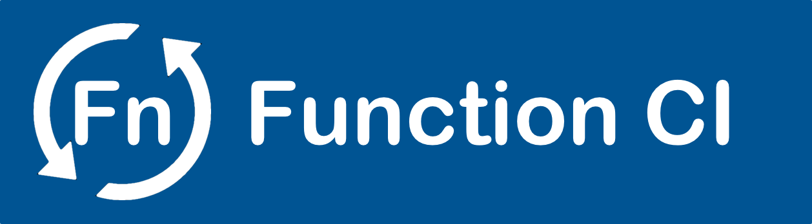
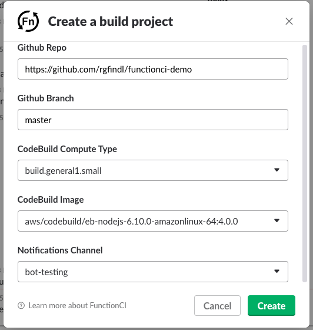
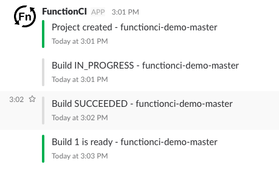
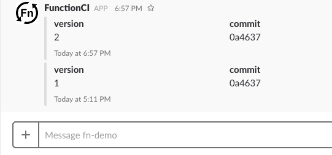
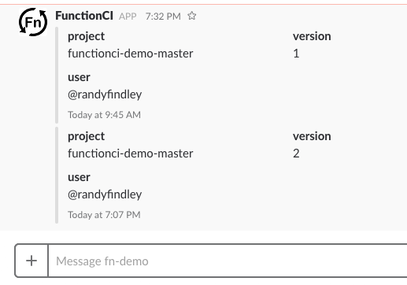
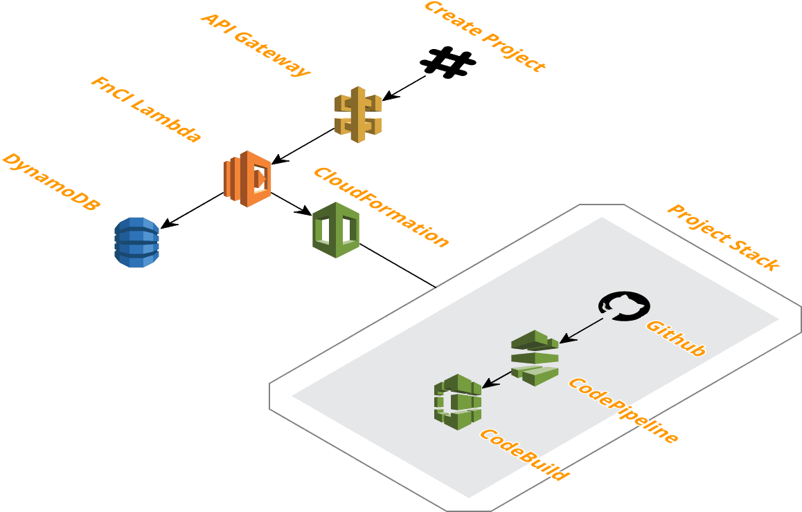
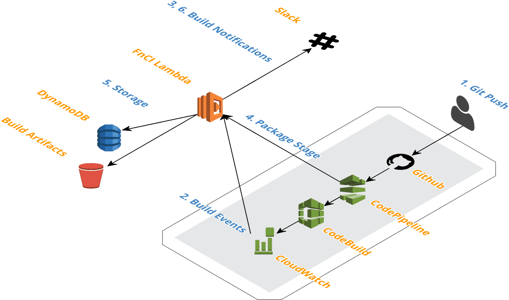
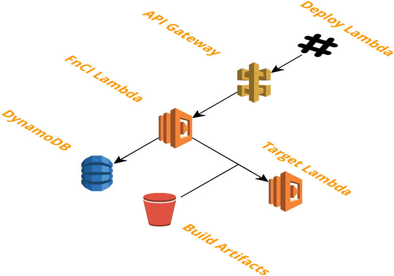

<p align="center">
  
</p>

# Function CI
FunctionCI is an open source Continuous Integration tool for AWS Lambda's. 

Builds are done by AWS CodeBuild and AWS CodePipeline.  

Receive build notifications via Slack.  Deploy via Slack.  View build and deployment audit trails via Slack.

Fork this repo and install FunctionCI in your AWS account, then start managing your Lambda's properly.  

## Features
* Serverless - Function CI only costs money when you use it
* Github integration
* Slack bot
* Versioned build artifacts stored in S3
* Build and deployment audit trails with Github commit version and Slack username

## Table of content
- [Usage](#usage)
- [Setup](#setup)
- [Commands](#commands)
- [Architecture](#architecture)

## Usage
Use the `/fn create project` Slack command to create a new build project.

<p align="left">
  
</p>

Once your build version is ready...

<p align="left">
  
</p>

Deploy it using the `/fn deploy fn <fn-name> <project-name> <version>` Slack command.

## Setup
1. Fork and clone this repo.
2. Install [CIM](https://github.com/thestackshack/cim) (CloudFormation Utility)
3. Install the [kms](kms/README.md) stack.
4. Install the [app](app/README.md) stack.

** If you fix or add anything please submit a Pull Request!!!

## Commands
- [/fn create project](#fn-create-project)
- [/fn show projeect](#fn-show-project)
- [/fn show projeects](#fn-show-projects)
- [/fn delete projeect](#fn-delete-project)
- [/fn add fn](#fn-add-fn)
- [/fn show fn](#fn-show-fn)
- [/fn show fns](#fn-show-fns)
- [/fn deploy fn](#fn-deploy-fn)
- [/fn delete fn](#fn-delete-fn)

### /fn create project
`/fn create project`

Register a new Github repo that you wish FunctionCI to build.  

FunctionCI uses [CodeBuild](http://docs.aws.amazon.com/codebuild/latest/userguide/build-spec-ref.html), so you will need a `buildspec.yml` in the root of your repo.

Here is an example `buildspec.yml` for a node.js project.  

** Note you must export a single zip artifact.

```
version: 0.2

# aws/codebuild/eb-nodejs-6.10.0-amazonlinux-64:4.0.0
phases:
  install:
    commands:
  pre_build:
    commands:
      - echo Installing source NPM dependencies...
      - npm install
  build:
    commands:
      - echo Testing the code
      - npm test
  post_build:
    commands:
      - echo Removing dev dependencies
      - rm -Rf node_modules
      - npm install --production
artifacts:
  files:
    - '**/*'
  type: zip

```

### /fn show project
`/fn show project <project_id>`

Show the most recent builds in reverse chronological order.

The `project_id` will be `<your repo name>-<branch>`.  

Example:
* Repo: https://github.com/rgfindl/functionci-demo 
* Branch: master

The `project_id` == `functionci-demo-master`

<p align="left">
  
</p>

### /fn show projects
`/fn show projects`

Show all the projects under management.

### /fn delete project
`/fn show project <project_id>`

Delete the project and all build artifacts.

### /fn add fn
`/fn add fn <short_name> <lambda-name>`

Add a Lambda function you wish to deploy build artifacts to.

Ex: `/fn add fn demo functionci-demo-LambdaFunction-LFREQ3DEC3UJ`

### /fn show fn
`/fn show fn <short_name>`

Show a function and all its deployment history.

Ex: `/fn show fn demo`

<p align="left">
  
</p>

### /fn show fns
`/fn show fns`

Show all the functions under management

Ex: `/fn show fns`

### /fn deploy fn
`/fn deploy fn <short_name> <project_id> <version>`

Deploy a build artifact to the Lambda function.

Ex: `/fn deploy fn demo functionci-demo-master 1`

### /fn delete fn
`/fn delete fn <short_name>`

Delete a function and all its deployment history.

Ex: `/fn delete fn demo`

## Architecture
FunctionCI is also a serverless Lambda app.  It includes the following AWS resources:
* API Gateway (Exposes an API for our Slack bot)
* Lambda (Slack bot API, SNS events, CloudWatch events, CodePipeline events)
* DynamoDB (Document storage)
* S3 (Build artifacts)
* CloudFormation (Builds a pipeline for each project)
* CodePipeline and CodeBuild (Performs builds)

### Create Project
When you create a new project FunctionCI creates a new CloudFormation stack.  This stack is the build pipeline for your project.
<p align="left">
  
</p>

### Build Project
When you commit changes to your Github repo CodePipeline is triggered.  The first CodePipeline stage is CodeBuild to build, test, and package your app.  The next CodePipeline stage is the FunctionCI Lambda to version and archive the build artifact.  
<p align="left">
  
</p>

### Deploy Lambda
Now we are ready to deploy our build artifact to our Lambda.
<p align="left">
  
</p>