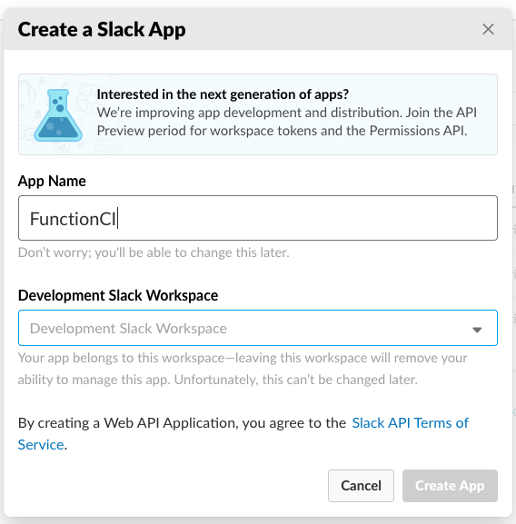
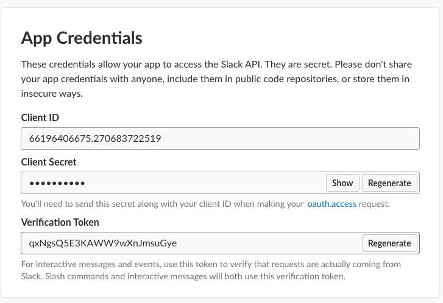
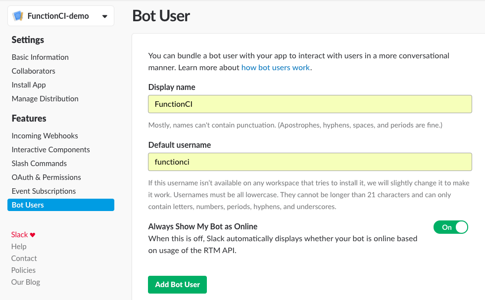
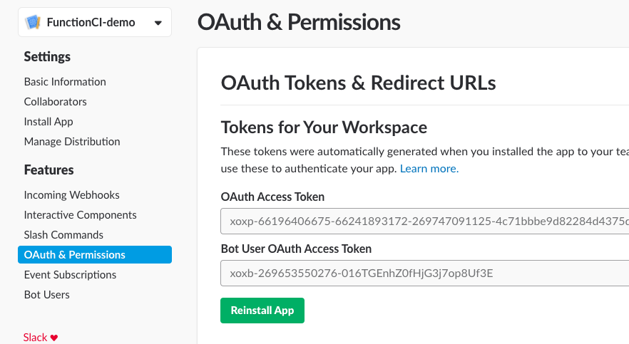
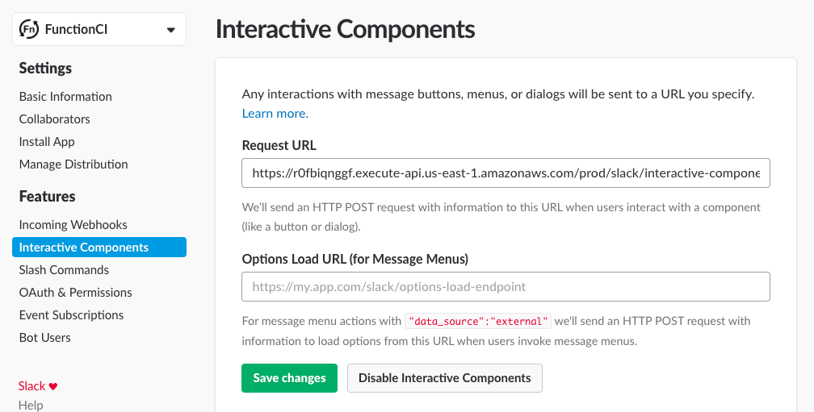
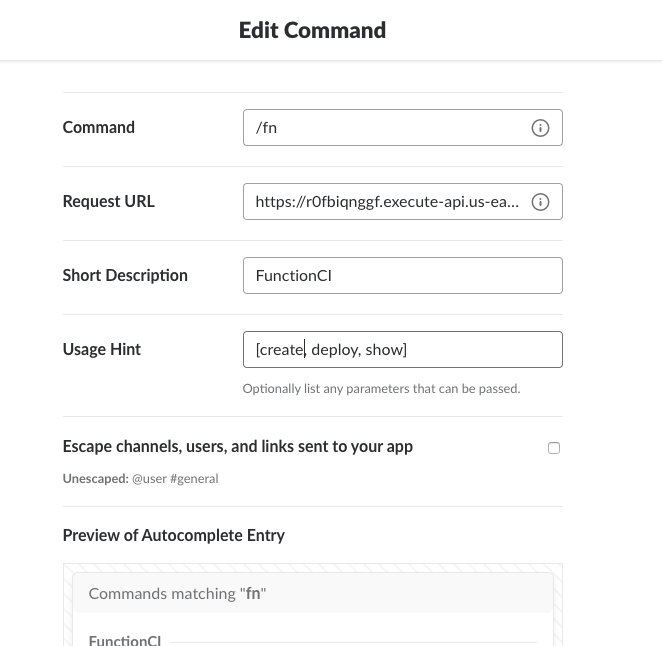
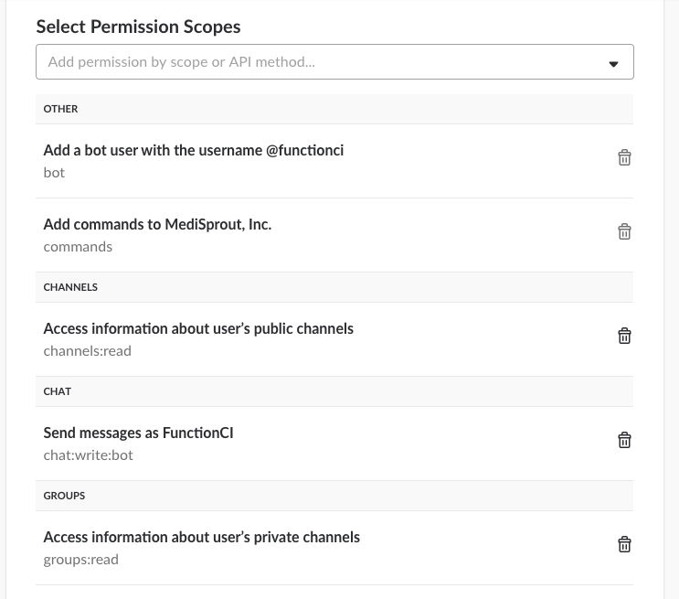

# App Stack
Creates the FunctionCI application.

## Step 1 - Create Slack App
Login to your Slack team, navigate to https://api.slack.com/, and click [Start Building](https://api.slack.com/apps?new_app=1).

  

## Step 2 - Encrypt Slack Verification Token
Encrypt your `VerificationToken` and add it to [_cim.yml](_cim.yml).

  

## Step 3 - Create Slack Bot
Create a bot user.

  

## Step 4 - Install Slack to Team
Install your app.  Then encrypt your `Bot User OAuth Access Token` and add it to [_cim.yml](_cim.yml).

  

## Step 5 - Create Github Token
Create a [Github personal access token](https://github.com/settings/tokens) with `repo` and `admin:repo_hook` permissions.  Then encrypt the `Github Token` and add it to [_cim.yml](_cim.yml).

  

## Step 6 - Install the stack
Install the app stack using the following [CIM](https://github.com/thestackshack/cim) command: `cim stack-up`.

Record the stack outputs, you will need them in the next 2 steps:
* SlackInteractiveComponentsUrl
* SlackSlashCommandsUrl

## Step 7 - Add the `Interactive Components` Slack Feature
Us the `SlackInteractiveComponentsUrl` from the stack output as the `Request Url`.

  

## Step 8 - Add Slack `Slash Command`
Us the `SlackSlashCommandsUrl` from the stack output as the `Request Url`.

  

## Step 9 - Add Slack Permissions
Add the following permissions to your Slack app under the Oauth & Permissions section.

* channels:read
* chat:write:bot
* groups:read

  

## Step 10 - Reinstall your app
After making these changes to your Slack app you will have to reinstall it.

## Step 11 - Start using your FunctionCI bot
Now you're ready to start using your FunctionCI Slack bot.

If you want to use your bot in private channels you'll have to invite it.  `/invite functionci`.

Check out the [FunctionCI Commands](../README.md#commands) to get started building and deploying your Lambda's. 
